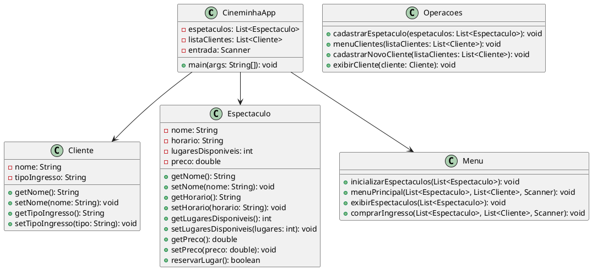

# CineminhaApp

**CineminhaApp** é um sistema simples de gestão de espetáculos e ingressos para um cinema. Desenvolvido em **Java**, com foco em práticas de **orientação a objetos**, **listas dinâmicas** e **menus interativos**. Ideal para aprendizado ou projetos acadêmicos.

## 📚 Descrição

O **CineminhaApp** permite:

- 📌 **Cadastrar espetáculos** com nome, horário, número de lugares e preço.
- 🧾 **Listar espetáculos** disponíveis.
- 👤 **Cadastrar clientes** com seu tipo de ingresso (inteira, meia, etc).
- 🎟️ **Comprar ingressos** (com verificação de lugares disponíveis).
- 📋 **Exibir dados** dos clientes cadastrados.

## 🧱 Estrutura de Classes (UML Simplificada)

- **CineminhaApp**: Classe principal do sistema.
- **Espetaculo**: Representa um espetáculo no cinema.
- **Cliente**: Representa um cliente com nome e tipo de ingresso.
- **Menu**: Contém os menus principais e operações de exibição e compra.
- **Operacoes**: Agrupa funções auxiliares como cadastro e listagem.

## 🔧 Tecnologias Utilizadas

- ☕ **Java SE (JDK 11 ou superior)**
- 📥 **Scanner** (para entrada de dados no terminal)
- 🧮 **Listas** (ArrayList) para manipulação dinâmica de dados

---

## Estrutura de Diretórios

```bash
Projeto/
├── CineminhaApp.java       # Classe principal
├── Cliente.java            # Representa um cliente
├── Espetaculo.java         # Representa um espetáculo
├── Menu.java               # Menus de interação
├── Operacoes.java          # Métodos auxiliares
└── README.md               # Documentação do projeto

```
## UML do projeto


Codigo em PlantUML


## 🚀 Melhorias Futuras

Aqui estão algumas melhorias simples que podem ser feitas para expandir o sistema:

- **Integração com banco de dados**: Adicionar a capacidade de salvar as informações de espetáculos, clientes e vendas em um banco de dados (como **MySQL**, **SQLite** ou **PostgreSQL**) para persistência de dados, evitando a perda de informações quando o programa é fechado.

- **Validação de entradas**: Melhorar a validação das entradas de dados no terminal, como garantir que o preço dos ingressos seja um valor positivo ou que a quantidade de lugares seja um número inteiro válido.

- **Armazenamento de sessões**: Permitir que os usuários consultem a disponibilidade de ingressos por sessão, armazenando o número de ingressos vendidos para cada horário de espetáculo.

- **Controle de estoque de ingressos**: Implementar um controle mais eficaz da disponibilidade de ingressos para cada sessão, evitando que o sistema permita a venda de ingressos quando todos os lugares já estiverem ocupados.

- **Exportação de dados**: Adicionar a funcionalidade de exportar os dados de clientes e vendas para um arquivo CSV ou Excel para facilitar relatórios e análise.
