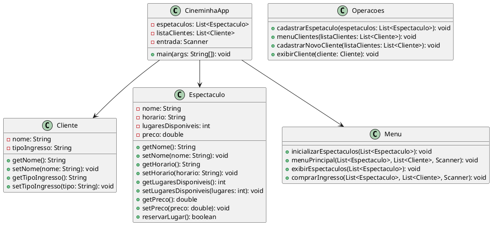

# CineminhaApp

Sistema de gestão de espetáculos e ingressos com duas implementações no mesmo repositório:

- Aplicação web em React + TypeScript (frontend + API Node/Express em TypeScript).
- Aplicação acadêmica em Java (console), no diretório `Projeto/`.

## 📚 Descrição (lógica Java do projeto)

**CineminhaApp** é um sistema simples de gestão de espetáculos e ingressos para um cinema. Desenvolvido em **Java**, com foco em práticas de **orientação a objetos**, **listas dinâmicas** e **menus interativos**. Ideal para aprendizado ou projetos acadêmicos.

O **CineminhaApp** permite:

- 📌 **Cadastrar espetáculos** com nome, horário, número de lugares e preço.
- 🧾 **Listar espetáculos** disponíveis.
- 👤 **Cadastrar clientes** com seu tipo de ingresso (inteira, meia, etc).
- 🎟️ **Comprar ingressos** (com verificação de lugares disponíveis).
- 📋 **Exibir dados** dos clientes cadastrados.

## 🧱 Estrutura de Classes (UML Simplificada)

- **CineminhaApp**: Classe principal do sistema.
- **Espetaculo**: Representa um espetáculo no cinema.
- **Cliente**: Representa um cliente.
- **Menu**: Contém os menus principais e operações de exibição e compra.
- **Operacoes**: Agrupa funções auxiliares como cadastro e listagem.

## 🔧 Tecnologias Utilizadas (Java)

- ☕ **Java SE (JDK 11 ou superior)**
- 📥 **Scanner** (entrada de dados no terminal)
- 🧮 **Listas** (**ArrayList**) para manipulação dinâmica de dados

---

## Estrutura de Diretórios

```bash
Projeto/
├── CineminhaApp.java       # Classe principal
├── Cliente.java            # Representa um cliente
├── Espetaculo.java         # Representa um espetáculo
├── Menu.java               # Menu de interação
├── Operacoes.java          # Métodos auxiliares

server/
└── index.ts                # API web em TypeScript

client/                     # Frontend React + TypeScript
shared/                     # Tipos/schemas compartilhados
```

## UML do projeto


Codigo em PlantUML


## Como rodar a versão web (React + TypeScript)

Pré-requisitos:

- Node.js 18+
- npm 9+

Comandos:

```bash
npm ci
npm run dev
```

Build de produção:

```bash
npm run build
npm start
```

## Endpoints principais da API web

- `GET /api/dashboard/metrics`
- `GET /api/espetaculos`
- `POST /api/espetaculos`
- `GET /api/clientes`
- `POST /api/clientes`
- `GET /api/clientes/cpf/:cpf`
- `POST /api/vendas`

## Como rodar a versão Java (console)

Pré-requisito:

- JDK 11+

Comandos:

```bash
javac Projeto/*.java
java Projeto.CineminhaApp
```

## Organização atual do projeto

- A pasta `Projeto/` é a fonte oficial da implementação Java.
- A pasta `server/` agora contém apenas o backend TypeScript da aplicação web.
- Arquivos duplicados Java com timestamp e artefatos do Replit foram removidos para manter a organização.
